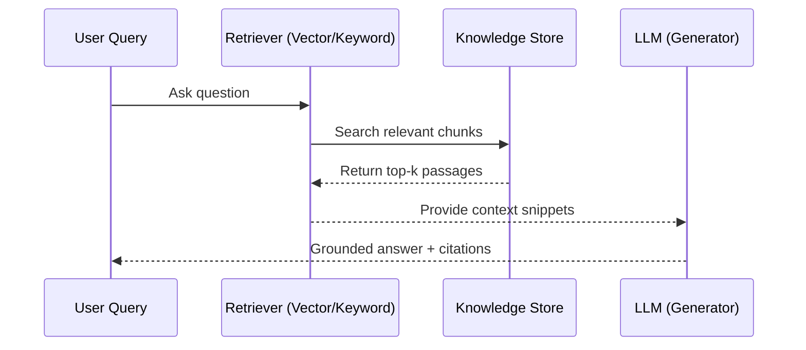

# Module 7 — Foundational Models and Tools

AI today is powered by large, general‑purpose systems known as **Foundational Models**. These models, trained on massive datasets, are capable of many tasks and underpin the **AI tools** we use daily. This module connects the conceptual foundations we have studied so far (Modules 1–6) with practical engagement, preparing you for Module 8’s case studies.

## Learning Objectives

After completing this module, you will be able to:
- Define **foundational models** and distinguish them from task‑specific models.
- Identify major **model families** (language, vision, multimodal, code) and where they’re used.
- Navigate the **tooling ecosystem** (assistants, copilots, open‑source stacks, deployment options).
- Customize models responsibly using **prompting**, **context engineering**, **RAG**, and light‑weight **adapters**.
- Build simple **Projects/workflows** that combine models, data, and evaluation.
- Apply **responsible AI** practices: privacy, safety, transparency, and basic model evaluation.

## 🧠 Part I — What Are Foundational Models?

**Foundational Models** are large, pre‑trained AI systems adapted to many downstream tasks. They provide a **common base of knowledge and reasoning** for specialized applications.

**Families & exemplars (illustrative):**
- **Language** — general LLMs for writing, QA, tutoring.
- **Vision** — image understanding, detection, segmentation.
- **Multimodal** — models that handle text + image + audio/video.
- **Code** — code completion, explanation, refactoring, tests.

### Key Characteristics

| Feature | Description |
|:--|:--|
| **Scale** | Trained on very large corpora with high‑performance compute. |
| **Transferability** | Adapt to new tasks with little additional data. |
| **Multimodality** | Process multiple data types (text, image, audio, code). |
| **Emergent Behavior** | Capabilities not explicitly programmed may appear. |
| **Alignment** | Instruction‑tuning & feedback align models to human intent and safety. |

> **Key message:** Foundational models are **bases** you shape with context and lightweight adaptation.

---

## ⚙️ Part II — The Tooling Landscape

Below is a layered view of how **infrastructure**, **data/knowledge**, **methods**, and **applications** fit together.

```mermaid
flowchart TB
  subgraph L0[Infrastructure Layer]
    C1[Compute:\nGPUs/TPUs, Edge/Cloud, HPC]
    S1[Storage:\nData Lakes, Warehouses, Object Stores]
    P1[Pipelines:\nStreaming, Batch, ETL/ELT]
    F1[Frameworks:\nSpark, Ray, Hadoop/Flink]
  end

  subgraph L1[Data & Knowledge Layer]
    D1[Big Data (5Vs)]
    D2[Data Science]
    D3[KDD ➜ Data Mining]
    D4[NLP Corpora & Tools]
  end

  subgraph L2[Method Layer]
    M1[Symbolic AI]
    M2[Machine Learning]
    M3[Deep Learning]
    M4[Computational Intelligence]
    M5[Natural Computing]
    M6[Soft Computing (hybrids)]
  end

  subgraph L3[Application Layer]
    A1[Vision & Perception]
    A2[Speech & Language (NLP)]
    A3[Recommenders & Personalization]
    A4[Robotics & Control]
    A5[Decision Support & Analytics]
    A6[Generative AI (text/image/code/audio/video)]
  end

  C1 --> L1
  S1 --> L1
  P1 --> L1
  F1 --> L1
  L1 --> L2
  L2 --> L3
```

**Categories & examples:**  
- **General assistants:** multi‑purpose chat + reasoning (summaries, QA, analysis).  
- **Copilots (embedded AI):** productivity suites (docs/slides/email), IDEs, design tools.  
- **Open‑source/local:** model hubs and runtimes for custom deployment.  
- **Connectors:** files (PDF/CSV), vectors, retrieval, and tool‑use integrations.

---

## 🧩 Part III — Customization Patterns (No/Low‑Code First)

1) **Prompting & Context Engineering (recap of Modules 5–6)**  
Roles, constraints, audience, output contracts; guardrail instructions (cite sources, allow “I don’t know”).

2) **RAG (Retrieval‑Augmented Generation) — Concept**  
When to use RAG: grounding, citations, up‑to‑date facts. High‑level flow: **ingest → chunk/index → retrieve → generate**.



3) **Adapters & Light Fine‑Tuning (conceptual)**  
LoRA/adapters to shape style or domain responses; use only when prompting + RAG are insufficient.

4) **Function/Tool Use (conceptual)**  
Let models call calculators, tables, or APIs; improves reliability for tasks like math or structured outputs.

> **Rule of thumb:** escalate from **prompting → context → RAG → adapters** only as needed.

---

## 🧮 Part IV — Projects & Workflows (Hands‑On Mini‑Labs)

Below are **four labs** you can run in ChatGPT (Custom GPT or Projects) or a comparable environment.

### Lab 1 — Doc QA with Grounding (RAG‑lite)

**Goal:** Ask questions about your own documents with sourced answers.  
**Setup:** Upload 2–3 short PDFs/Markdown files (policy/syllabus/guide).  

**Prompt shell:**
```
System: You are a careful analyst. Only answer using uploaded files. If unsure, say “I don’t know.”
Task: Answer the question below with paragraph‑level citations (file name + page/heading).
Question: <your question>
Output format: Markdown with a short answer, bullet citations, and a 1‑sentence caveat.
```

**Deliverable:** A Q&A snippet with **citations** and a one‑line caveat.

---

### Lab 2 — Data Explainer (Small CSV)

**Goal:** Turn a small CSV into quick understanding.  
**Setup:** Upload a tiny CSV (≤ 1–2 KB per column; e.g., 100–500 rows).  

**Prompt shell:**
```
System: You are a data analyst. If no code execution is available, describe the method; do not fabricate numbers.
Task:
1) Create a column dictionary (name, inferred type, note).
2) List 5 quality checks (nulls, ranges, duplicates, outliers, consistency).
3) Provide 5 insights framed as observations + implications.
4) Suggest one chart with title, axes, and why it helps.
Output: Markdown tables where appropriate.
```

**Deliverable:** Column dictionary, checks, insights, and a chart brief.

---

### Lab 3 — Policy/Guideline Assistant (Grounded Answers)

**Goal:** Answer FAQs from a policy or guideline with references.  
**Setup:** Upload one policy/guideline PDF or MD file.  

**Prompt shell:**
```
System: You are a policy assistant. Quote or paraphrase only from the uploaded file; include section/heading references.
Task: Answer the following 5 FAQs as short paragraphs with a bullet list of cited sections.
Constraints: If content is not in the file, respond “Not specified in the provided policy.”
```

**Deliverable:** 5 grounded answers + citations.

---

### Lab 4 — Quick Custom GPT / Project

**Goal:** Create a small, reusable workspace/assistant.  
**Setup:** In Custom GPTs or Projects, add: instructions, 2 reference files, and a preferred output schema.  

**Instruction template (paste into Custom GPT/Project):**
```
Role & Purpose: Act as <role> (e.g., course tutor, policy assistant). Answer only using the uploaded references when possible.
Audience & Tone: <define audience>; clear, concise, cite sections; allow “I don’t know” when unsure.
Output Contract: Use Markdown; include a brief caveat and a short checklist or action items at the end.
Limits & Safety: No private/sensitive data; do not make legal/medical decisions; defer to humans for critical judgments.
```

**Test queries (examples):**
- “Summarize the main requirements in one paragraph with 3 cited bullets.”  
- “Extract 5 FAQs with answers and section references.”

**Deliverable:** A short transcript (2–3 exchanges) and one final answer artifact.

---

## 🔒 Part V — Responsible & Human‑Centered Use

**Principles:** transparency, privacy, fairness, and proportionality of use.  
**Practices:** disclose AI assistance; de‑identify sensitive data; verify claims; permit “I don’t know.”

> Download the **Reliability & Responsibility Checklist** and include it in your Lab submissions.

- [Download: Module 7 Reliability & Responsibility Checklist (Markdown)](Module7_Reliability_Checklist.md)

---

## 🧭 Part VI — Putting It Together (Bridge to Module 8)

Choose one domain (education, healthcare, environment, business, arts) and build a **Project** that:
1) Loads references/data.  
2) Answers 3 task types (Q&A, summary, structured output).  
3) Outputs a short report with a caveat and next steps.  
4) Uses the checklist to self‑evaluate.

---

## 📘 Further Reading (vendor‑neutral)
- Foundation models: opportunities & risks; alignment and safety overviews.
- Concept primers on **RAG**, **instruction‑tuning**, and **tool use**.
- Practical guides on disclosure, privacy, and basic evaluation rubrics.

---

## ✅ What you should leave with
- A mental model of **which tool/model to use when**.
- Confidence to **ground** outputs in your own materials.
- A reusable **workflow template** (Projects/Custom GPT) to carry into Module 8.

